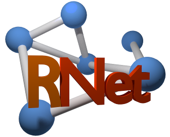
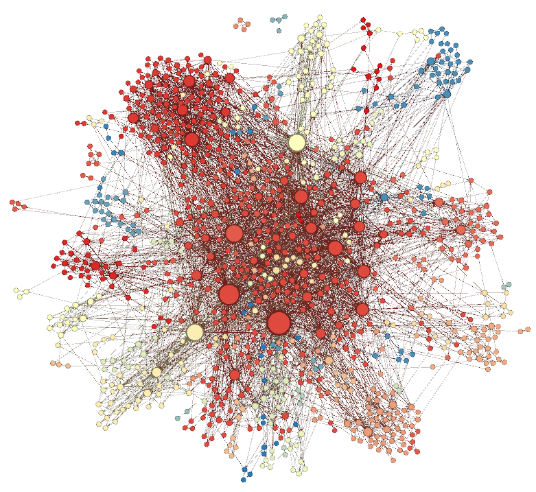

# Realistic random network generator

RNet is a realistic random network generator. It generates a social network from
some statistical parameters. It deliberately assign communities to each node to 
achieve realistic social behavior.

## Examples

* This network visualization was obtained using Gephi force atlas layout generator.

## Compilation

### Required:

> __G++__ The GNU Compiler Collection (GCC) is a compiler system produced by the
	GNU Project supporting various programming languages. GCC is a key
	component of the GNU toolchain.
	
> __Cmake__ is a cross-platform free software program for managing the build
        process of software using a compiler-independent method.

### Optional:

> __CCMake__ The "ccmake" executable is the CMake curses interface.

### Commands:

	# cd rnet/build
	# cmake ../src (or ccmake ../src)
	# make -j4
	# ./rnet

# Usefull Links

> Get started with CMake!
> Gephi, a great tool for graphs

Copyright (C) 2013 Matheus Caldas Santos
