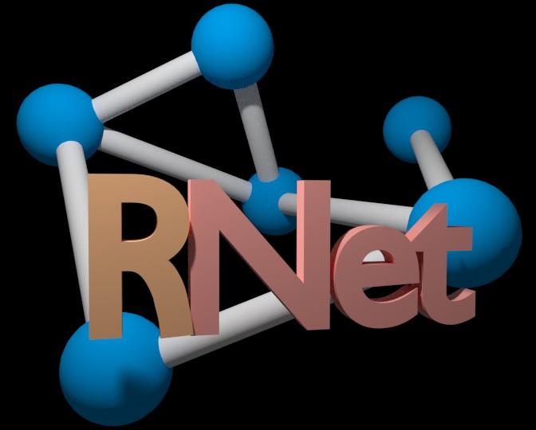

RNet - Realistic random network generator
=========================================

RNet is a realistic random network generator. It generates a social network from
some statistical parameters. It deliberately assign communities to each node to 
achieve realistic social behavior.

Compilation
-----------

- Required:

G++ 	- The GNU Compiler Collection (GCC) is a compiler system produced by the
	GNU Project supporting various programming languages. GCC is a key
	component of the GNU toolchain.
CMake 	- Cmake os a cross-platform free software program for managing the build
        process of software using a compiler-independent method.

- Optional:

CCMake	- The "ccmake" executable is the CMake curses interface.

- Commands:

` cd rnet/build
 cmake ../src
 make -j4
 ./rnet`

Copyright (C) 2013 Matheus Caldas Santos
