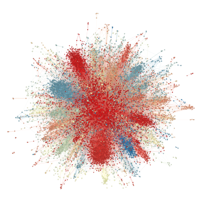

# Realistic random network generator

RNet is a realistic random network generator. It generates a social network from
some statistical parameters. It deliberately assign a community to each node to 
achieve realistic social behavior.

RNet is __highly flexible__, it can accept several parameters. Besides the size of the generated network, it also accepts: outdegree, indegree and community size probability distributions, probability of connecting inside a node community and probability of connecting a node to a totally random node. These parameters make possible to generate a large variety of networks with much smaller restrictions than other generators.

RNet is also __very fast__, it is possible to generate graphs with millions of vertices in matter of seconds! It uses multithreading to better explore modern CPU power.

## Examples

[Larger Image](http://github.com/mtcs/rnet/wiki/res/rnet10000.png)

[10000 node RNet Data file**](res/rnet10000-el.txt "rnet10000-el.txt.gz")

\* This network visualization was obtained using Gephi force atlas layout generator. Colors represent communities detected by "Fast Unfolding" Algorithm modularity algorithm and node size represent node Betweenness Centrality.

\*\* This file was generated with RNet using default parameters Power Law distributions and default probabilities.

For more information go to our [wiki](https://github.com/mtcs/rnet/wiki).

# Compilation

### Required:

* __GCC__ The GNU Compiler Collection (GCC) is a compiler system produced by the
GNU Project supporting various programming languages. GCC is a key component of 
the GNU toolchain.

* __OpenMP__ Support is required from the compiler, if you wish to use other 
compiler make sure it has OpenMP support.
	
* __Cmake__ is a cross-platform free software program for managing the build
process of software using a compiler-independent method.

> For Mac OS users:

> Calling gcc in the command line actually calls for XCode's LLVM, which uses clang 
and does not currently support openMP. To compile you must first download a working 
version of gcc (with homebrew?) and set cmake to work with it:

> `CC=[path-to-gcc] CXX=[path-to-g++] cmake ../src`

### Optional:

* __CCMake__ The "ccmake" executable is the CMake curses interface.

### Commands:

	# cd rnet/build
	# cmake ../src (or ccmake ../src)
	# make -j4
	# ./rnet
	
	
# References

_Yet to appear_

# Usefull Links

* [CAMPS](http://camps.dcc.ufmg.br/) - Center for Analisys and Modeling of Systems Performance and Social Media

* Get started with CMake! [\[1\]](http://www.cmake.org/cmake/help/cmake_tutorial.html, "CMake Tutorial")
 [\[2\]](http://wiki.icub.org/yarpdoc/using_cmake.html)

* [Gephi](https://gephi.org/), a great tool for graphs

